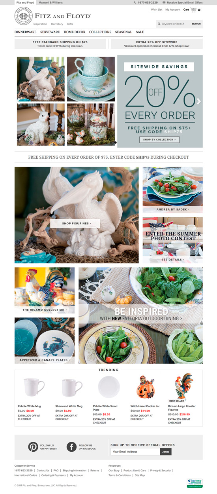
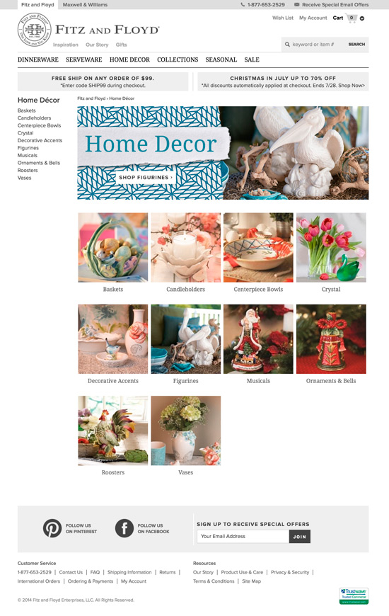
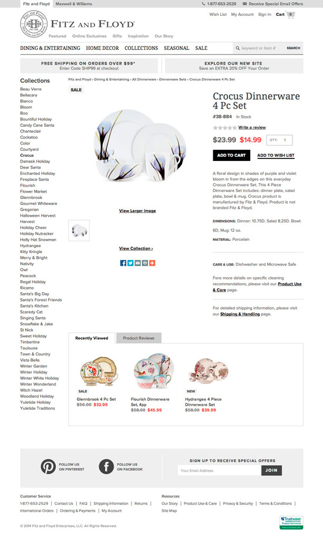
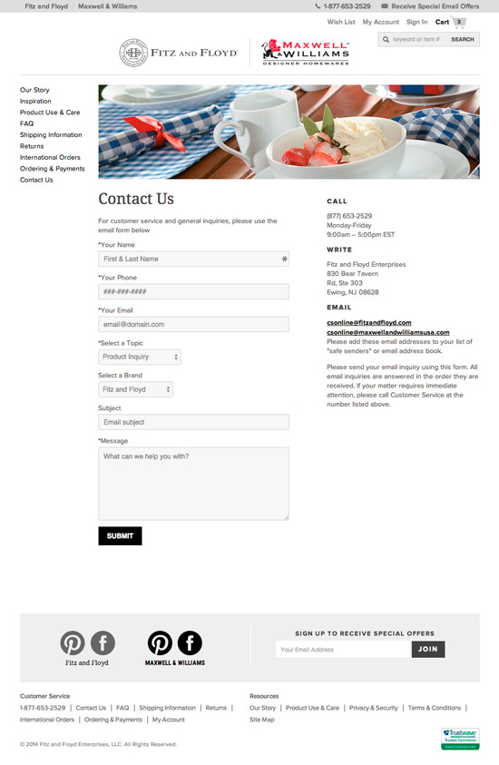
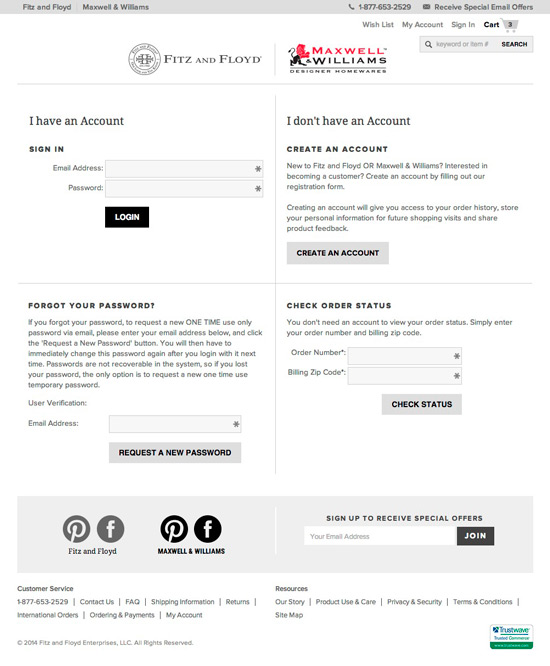
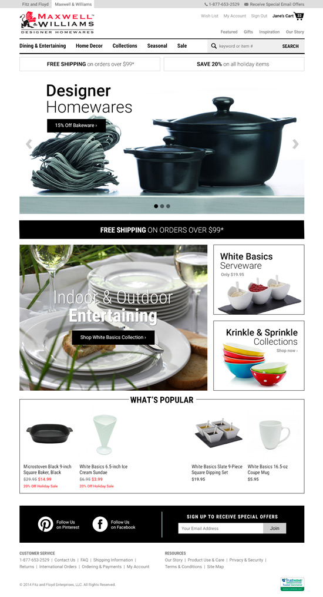
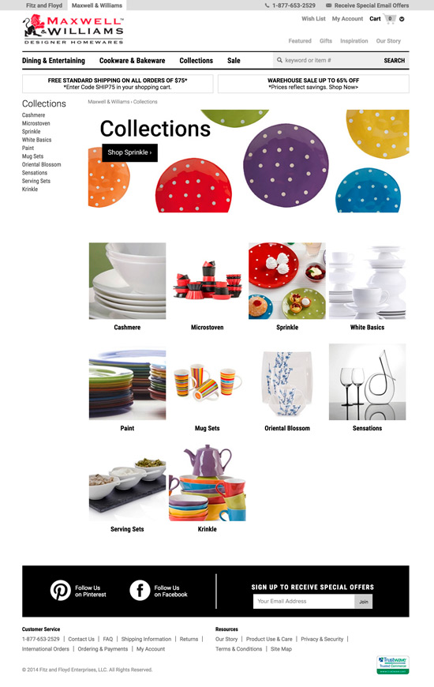
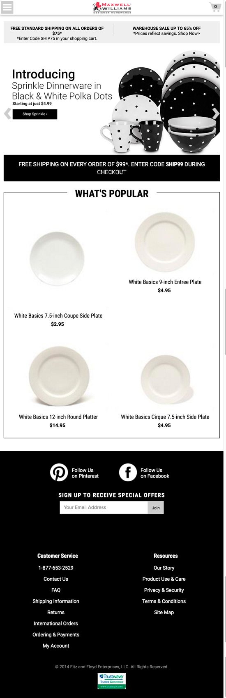

# Fitz and Floyd/Maxwell & Williams

## About
This is a past project for which I built the front end. The project involved developing the front end of the two affiliated sites, Fitz & Floyd and Maxwell & Williams, and integrated them with the shopping cart platform.  I didn't keep much of the code but the screenshots hopefully demonstrates the scope of the work.

## Tech Stack

**Languages:** HTML, CSS, Javascript/jQuery   
**Framework:** ASP.NET

## Screenshots

### Fitz and Floyd Home Page

    

 

### Category Page

    

 

### Product Detail Page

    

 

### Cart

    

 

### Contact Page

    

 

### Account Signin Page

    

 

### Maxwell & Williams Home Page

    

 

### Category Page

    

 

### Mobile View

    

 

## Live Link
[https://www.fitzandfloyd.com/](https://www.fitzandfloyd.com/)  
[https://www.maxwellandwilliams.com](https://www.maxwellandwilliams.com.au/) 
