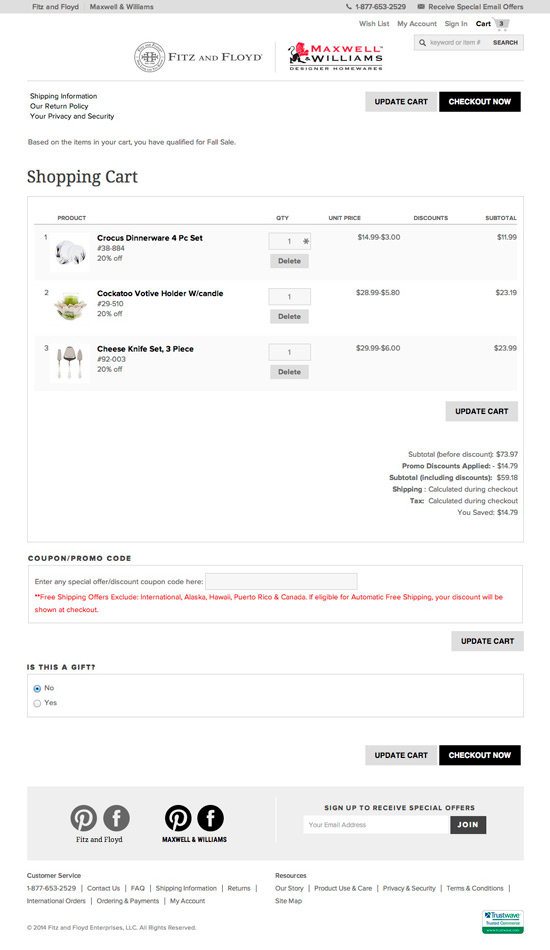

# Fitz and Floyd/Maxwell & Williams

## About
This is a past e-commerce project for which I built the front end. The project involved developing the front end of the two affiliated sites Fitz & Floyd and Maxwell & Williams and integrate it with the shopping cart platform.  

## Tech Stack

**Languages:** HTML, CSS, Javascript/jQuery   
**Framework:** ASP.NET

## Live Link
[https://www.fitzandfloyd.com/](https://www.fitzandfloyd.com/) 

    

 

    

 

    

 

    

 

    

 

    

 

    

 

    

 

    

 
